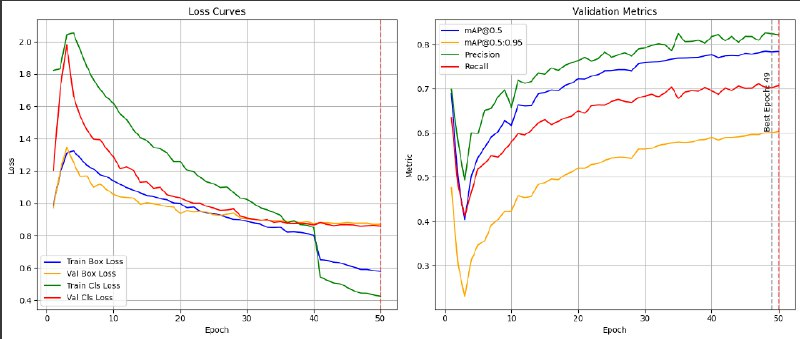

# YOLOv8 on Pascal VOC 2012

This project fine-tunes YOLOv8 models on the Pascal VOC 2012 dataset for object detection. We conducted several experiments using different training settings to compare model performance.


---

##  Experiments Summary

| Experiment | Model       | Batch | LR     | mAP@0.5 | mAP@0.5:0.95 | Precision | Recall | Notes                      |
|------------|-------------|-------|--------|---------|--------------|-----------|--------|----------------------------|
| Exp #1     | yolov8s.pt  | 16    | 0.01   | ~0.75   | ~0.58        | 0.7336    | 0.6238 | Strong augmentations       |
| Exp #2     | yolov8m.pt  | 16    | 0.003  | ~0.76   | ~0.59        | High      | Good   | Moderate aug, wd added     |
| Exp #3     | yolov8m.pt  | 32    | 0.0025 | 0.7841  | 0.6031       | 0.8214    | 0.7065 | Best results (Epoch 49)    |


---

## 📈 Final Results
### Exp #3 - YOLO_Voc_best.ipynb

**Best model results at Epoch 49:**

- `mAP@0.5`: **0.7841**
- `mAP@0.5:0.95`: **0.6031**
- `Precision`: **0.8214**
- `Recall`: **0.7065**

### 📊 Metric Graph Analysis

The graph below shows the evolution of metrics during training:

- The **loss curves** (train/val) decrease steadily, indicating stable optimization.
- **mAP@0.5** increases and peaks near epoch 49, which confirms convergence.
- **Precision and Recall** are both high and balanced, showing the model avoids excessive false positives or false negatives.

This consistency indicates the model is well-trained and generalizes well to the validation set.



---

##  Inference on Images 

```python
from ultralytics import YOLO
import cv2
from google.colab.patches import cv2_imshow

model = YOLO("Best/weights/best.pt")
image = cv2.imread("test.jpg")
results = model(image)
annotated = results[0].plot()
cv2_imshow(annotated)
```

---

## 🔄 Flexible Inference: Webcam or Video

Run detection in real-time from your webcam or any video file.

### Usage
```bash
python main.py
```
```
model = YOLO('best.pt')
```
When prompted:
- Type `webcam` for live camera input
- Or enter a path to a video file, e.g., `demo.mp4`

---

## ✅ Conclusion

We trained several YOLOv8 models with varying hyperparameters to optimize performance on the Pascal VOC dataset. The best model achieved **78.4% mAP@0.5** and is suitable for real-time detection on both webcam and videos.

---

## 📚 Requirements
- `ultralytics`
- `opencv-python`

Install dependencies:
```bash
pip install ultralytics opencv-python
```

---
